# Gachaman

**An RNG-governed challenge gamemode for Old School RuneScape, played entirely inside RuneLite.**

> Fate decides what you may train. Cards decide what you may wear. Chests decide everything else.

You don't choose your combat style — a wheel chooses it for you, and you train that until the
wheel changes its mind. You don't equip a sword because you found one — you equip it because a
card came out of a chest with its name on it, and you slotted that card into your loadout.
Everything in between is paid for in **Gacha Coins**, earned one kill at a time.

It's a gacha game bolted onto an MMO, and it turns "I got a drop" into "I got *permission*".

> **Read this first — it's honor mode.** All state lives in your RuneLite profile. Turning the
> plugin off removes every restriction instantly. Nothing here touches other players, the game
> server, or real money. See [Honest disclosures](#honest-disclosures).

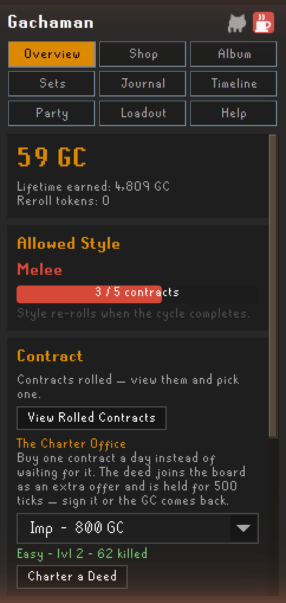

---

### Contents

[Your first hour](#your-first-hour) · [The loop](#the-loop) · [The wheel](#1--the-wheel-your-style-isnt-yours)
· [The board](#2--the-board-contracts-and-coin) · [The chest](#3--the-chest) · [The cards](#4--the-cards)
· [Rolling with friends](#rolling-with-friends) · [The long game](#the-long-game)
· [Your sidebar](#your-sidebar) · [Blocked quest monsters](#when-a-quest-monster-is-blocked)
· [Disclosures](#honest-disclosures) · [Settings](#settings) · [Commands](#commands)

---

## Your first hour

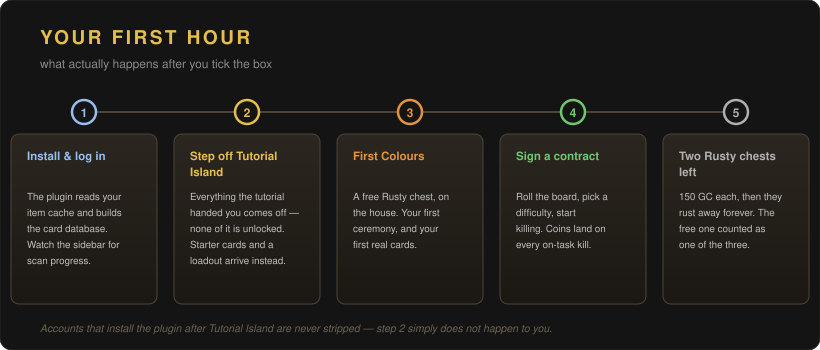

Install it, tick the box, log in. The plugin reads your item cache and builds a card for every
combat-relevant equipable item in the game — derived from the live cache, so nothing with stats
is missed, and cosmetic-only gear gets no card at all and stays freely wearable.

If you're starting a fresh account, **stepping off Tutorial Island strips everything it handed
you** — none of it is card-unlocked, so keeping it would mean wearing gear you could never
re-equip. Your starter cards and their auto-assigned loadout are waiting for you. If you installed
the plugin on an existing account, this never happens.

Then a free **First Colours** chest opens, and you're in.

---

## The loop

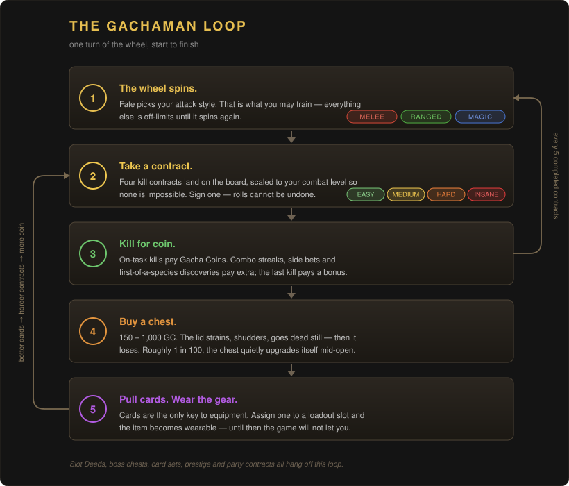

Five beats, forever. The rest of this page is just those five beats in detail.

---

## 1 · The wheel *(your style isn't yours)*

A roulette wheel picks **melee, ranged or magic**. That's what you train. It can land on the same
style twice in a row — fate is like that — and it **re-rolls after every 5 completed contracts**.

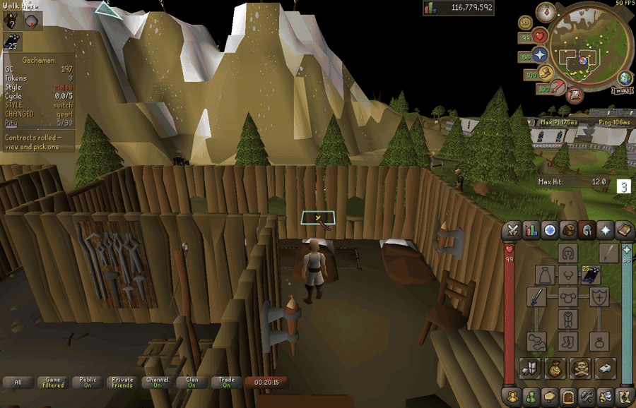

You can lean on the cycle from the shop:

| | Cost | Effect |
| --- | --- | --- |
| **Style Compactor** | 400 GC | Current contract counts **double** toward the re-roll, and each kill counts twice toward the contract itself. The skipped count pays no GC — you're trading income for speed. *For when you hate your style.* |
| **Style Extender** | 250 GC | Current contract counts **half** toward the cycle. *For when you love it.* |

Every profile starts with one free voucher of each.

### Breaking the lock

When the wheel changes your style you are only **warned**. The violation starts when you actually
*attack* with a forbidden style:

- every violating attack **deducts GC**
- kills finished while violating pay **zero** and add **taint**
- taint halves all income until you work it off — one compliant kill per taint — or clear it all at
  once with a harder **Redemption Task**

**The judge is fair.** Spell-cast animations always count as magic no matter what your weapon stance
says. Powered staves count as magic in every combat mode. And if a delayed Magic XP drop proves a
"melee" verdict wrong, the conviction is **pardoned** — penalty refunded, taint window cleared, and
any taint that conviction already caused is lifted, with a chat notice.

<details>
<summary>The one case that stays convicted</summary>

An auto-retaliate staff bash that *actually lands* is genuine melee, and stays convicted — set an
autocast spell or turn auto-retaliate off. The plugin tips you when this happens.

A pardon also doesn't re-score the kill itself: it lifts the ongoing tax, but a kill that paid zero
stays paid zero.
</details>

---

## 2 · The board *(contracts and coin)*

Roll four kill contracts — **Easy / Medium / Hard / Insane** — scaled to your combat level, so none
of them are impossible. Sign one. **Rolls can't be undone and a signed contract is binding.**

Because it's binding, the board only deals monsters you can actually walk up to: your combat level,
your Slayer level, whether you're on a members world, and **which quests you've finished**. A monster
locked behind a quest you haven't done is simply not in the deck until you do it — no Nechryael
before *Priest in Peril*, no Vorkath before *Dragon Slayer II*. Finish the quest and it joins the
deck on your next roll.

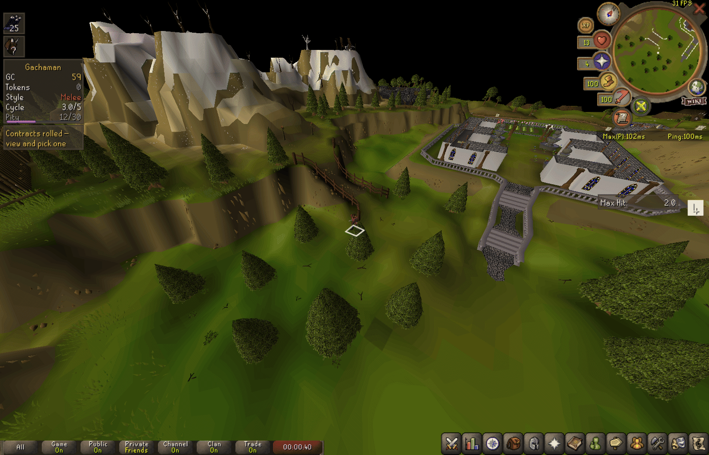

Every on-task kill pays Gacha Coins; the final kill pays a completion bonus. Stacked on top:

- **Side bets** — optional riders like *"land a 20+ hit"* or *"a kill without taking damage"*. Some
  are **sealed**, and only revealed the moment you accidentally satisfy them.
- **Rhythm Combo** — consecutive on-task kills within ~25 seconds build up to **+30% kill GC** at low
  combat, fading to a permanent **+10%** floor as you level.
- **Bestiary discovery** — the first on-task kill of each new species pays a bonus, with codex
  milestones at 50 / 100 / 150 species.

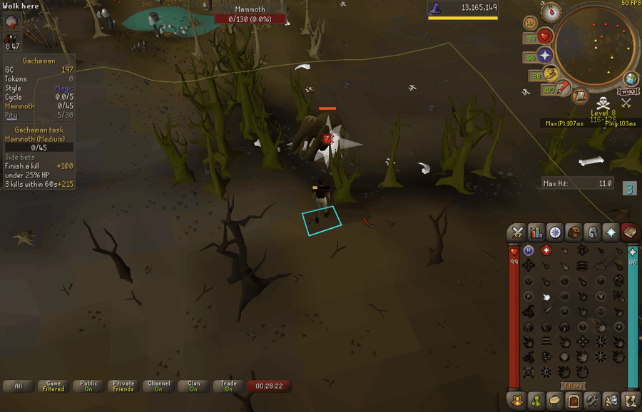

<details>
<summary><b>Ironman accounts</b> — assisted kills count half</summary>

On an ironman account, a kill another player damaged counts **half** (two assisted kills = one
count, and half GC), with a chat notice each time.

The rule **stands down entirely while you're on a shared party contract** — teammates piling onto
the same monster is the whole point — and re-arms if the carry clause converts the contract back
to solo.

Assist detection combines three signals: other players' hitsplats (including 0-damage splashes,
which void credit too), the game's own *"might not receive kill-credit"* warning (keep it enabled in
the game's Activities settings), and a **loot oracle** — kills are credited a couple of ticks after
despawn so the server's loot events can be observed. Loot received proves full credit and overrides
any suspicion (thralls, groupmates, NPC damage), while no loot from a guaranteed-drop monster
convicts even for damage dealt entirely off-screen.
</details>

<details>
<summary><b>The Double Docket</b> — real Slayer tasks pay extra</summary>

Kill your actual Slayer assignment while on contract and completion pays **×1.2**. It's checked when
you accept *and* on every kill, so picking the matching Slayer task up mid-contract still counts,
and once it locks in it stays even if you finish the Slayer task first.

Contracts are **never rolled to match** your assignment — that would add RNG draws inside the seeded
party path and desync the party — so this is a happy accident the game pays you for. Grouped
assignments (Metal dragons and the like) name no single monster and can't be detected. Every
contract shows its docket state.
</details>

<details>
<summary><b>The Charter Office</b> — buy one contract a day</summary>

Instead of waiting for the board to offer what you want, buy it. A target must be **familiar** — 25
banked kills, read straight off your journal — and must pass every gate a normal roll applies
(combat, slayer, members, quests), so a deed can never buy past a rule — banked kills on a monster
whose quest you never finished still won't put it on the counter. Price scales with how far you're
punching up: **800 – 2,500 GC** in round tens.

The GC is **held in escrow, not spent**. The deed joins your board as an extra offer for ~5 minutes,
and if you don't sign it the money comes back in full. The daily lock rolls over at **UTC midnight**.
The counter is closed while a party roll is live — a party's board isn't one player's to add to.
</details>

<details>
<summary><b>The Ante</b> — a voluntary stake (off by default)</summary>

Before you accept an **Insane** contract you may stake 10–50% of your purse (capped at 5,000 GC; no
offer under a 250 GC purse). Finish the contract and the stake returns **doubled**. Die and it's gone.

Arming is the only route by which GC is ever staked, nothing is preselected, and it takes **two
confirmations** — one naming the amount, one naming what losing means. Disarming takes none. While a
stake is live the Overview says so, because your purse is short by exactly that much.

In a party it takes **every** member agreeing to their own stake; each stakes from their own purse
and each loses only their own. One refusal means no Ante for anybody, and the contract goes ahead
regardless. Turning the setting off simply hides the offer.
</details>

---

## 3 · The chest

Coins buy chests. Chests are the only source of cards.

| Chest | Cost | Cards | Notes |
| --- | --- | --- | --- |
| **Rusty** | 150 GC | 1 | Commons only, **three opens EVER**, then it rusts away forever |
| **Battered** | 500 GC | 1 | |
| **Gilded** | 800 GC | 2 | |
| **Ornate** | 1,000 GC | 3 | Best value and best odds |

The Rusty chest is the intended first purchase — it's cheap, it draws only from your unlocked slots
and gear no higher than you can wield today, and its shiny odds are boosted to **1/16**. Your free
**First Colours** chest *is* a Rusty chest and **counts as one of the three**, so two are left to buy.

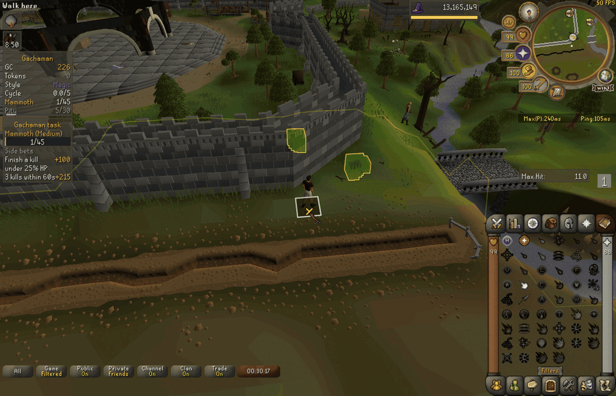

**The box tells you what it cost, and only that.** A chest fights before it opens: a shudder starts
the strain, the shaking climbs toward the give, then everything goes dead still for a beat and the
lid loses. Groans scale with the price — Rusty gets none at all, Battered two, Gilded three, Ornate
four. The schedule is a function of the tier you **bought** and nothing else, so the length of the
fight physically cannot betray what's inside.

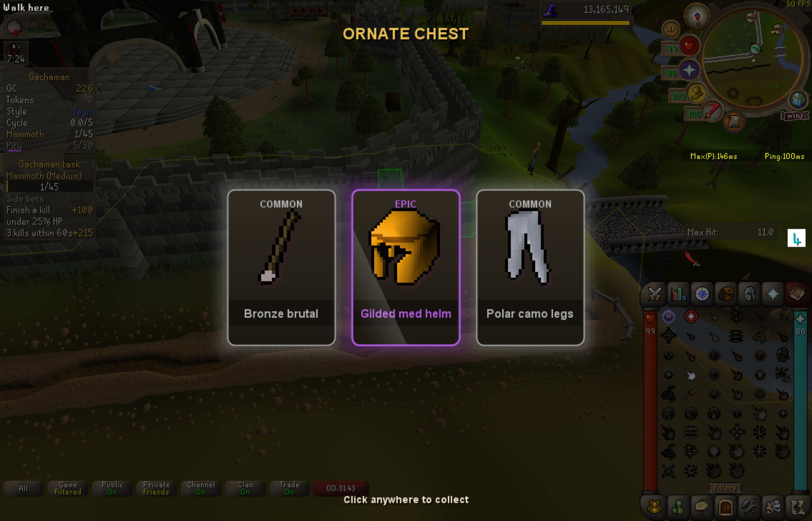

Things that can happen mid-open:

- **Jackpot upgrade** — ~1 in 100 opens, the chest upgrades itself mid-animation. The lid keeps the
  purchased tier's face until the deal, so the upgrade is a reveal and not a spoiler.
- **Pity** — a visible meter boosts your odds during dry streaks and guarantees a Legendary at the cap.
- **Reroll tokens** — every 10 combat levels gained grants one. During any reveal, re-flip one
  disappointing card.
- **Stardust** — a shiny roll that only just misses banks stardust. Eight of them bless your next
  chest with double shiny attempts on every card.

<details>
<summary><b>The House Lean</b> — the one weighted number, published</summary>

When a chest picks *which* item of a rarity you get, gear one tier above what you can wield today is
weighted **0.35×** against gear you can already use — so a card you can equip now is about **2.86×**
likelier than the equivalent tease.

It touches item choice only. Rarity odds, the jackpot upgrade, hologram replacement and the
first-card pity guarantee are all untouched, and Slot Chests roll Gilded odds.

The Shop tab's **Chest Odds** panel prints the real per-rarity percentages for every tier, computed
from the same constants the roller uses — so you can check the claim rather than take it.

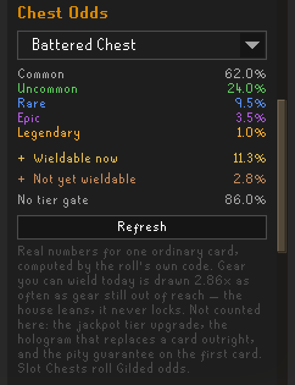
</details>

---

## 4 · The cards

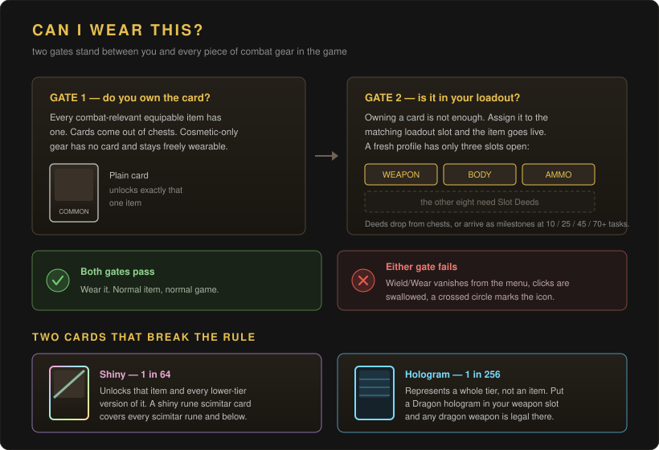

This is the rule that defines the gamemode, so it's worth saying plainly: **you may only wear a
carded item when you own its card *and* have assigned it to the matching loadout slot.** Forbidden
equipment has its Wield/Wear option removed and clicks consumed, with a crossed-circle icon in your
inventory and bank.

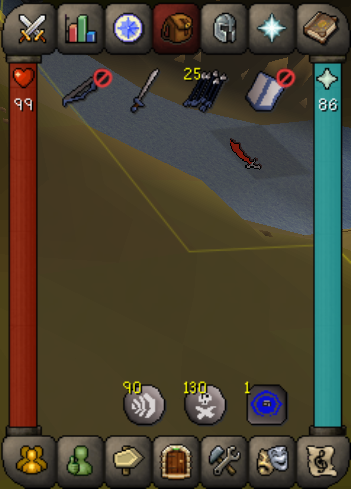

Two card types break that one-card-one-item rule:

- **Shiny** (1/64, prismatic) also unlocks every *lower-tier* version of the same piece — a shiny
  rune scimitar card unlocks all scimitars rune and below. Lowest-tier gear has no shiny, because
  there's nothing below it.
- **Hologram** (1/256, the rarest pull) represents an entire *tier*, not an item. Assign one to a
  single loadout slot and that slot may equip **any** item of that tier — a Dragon Hologram in your
  weapon slot permits any dragon weapon. Movable between slots.

### Gear slots start locked

A fresh profile can use only the **weapon, body and ammo** slots — so melee and ranged are both
trainable from the start, and your training sword and arrows come pre-assigned.

Ironman accounts also start with their **own** account type's armour cards — regular, ultimate,
hardcore, group, hardcore group or unranked group — and that set's platebody fills the body slot.
Normal accounts get none of it, since the game would never let them wear it anyway.

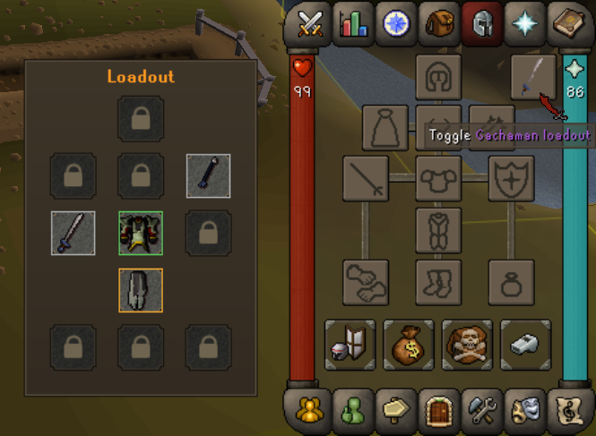

The other **eight slots need Slot Deeds**:

- rare chest drops (you pick which slot to unlock), or
- guaranteed milestones at **10 / 25 / 45 / 70 / 100 / 140 / 190 / 250 / 320** completed contracts —
  nine milestones for eight slots, so there's a spare.

Milestones stop once every slot is deeded, and a chest that rolls a deed after that pays **2,000 GC**
instead. During your first five contracts, Medium/Hard/Insane completions also pay **Deed Fragments**
(1/2/3) — ten fragments forge one bonus deed, once per account.

### The Service Record

Every card counts the kills it was **present for** — assigned to a loadout slot when the kill landed —
and the number is permanent. Past **100 / 400 / 1,000** kills a card wears *Hairline* / *Cracked* /
*Shattered, still holding*, drawn the way a played trading card actually ages: the print wears through
at the rim and the pale stock shows, worst at the corners; creases run across the face with a shadow
on one side and a lit ridge on the other; fine scratches come off sleeving; patina settles over it.

Every card wears differently, and every card at the same stage carries the same *amount* of it. The
counts and opacities are fixed per stage, so a *Shattered* card reads as *Shattered* at a glance —
only where the creases enter, which way the scratches lean and where the rim thins are per-card.

No rule anywhere reads it. A worn card rolls, equips, completes sets, burns at prestige and prices in
the shop exactly like a pristine one. It's a veteran's stripe, not a durability system.

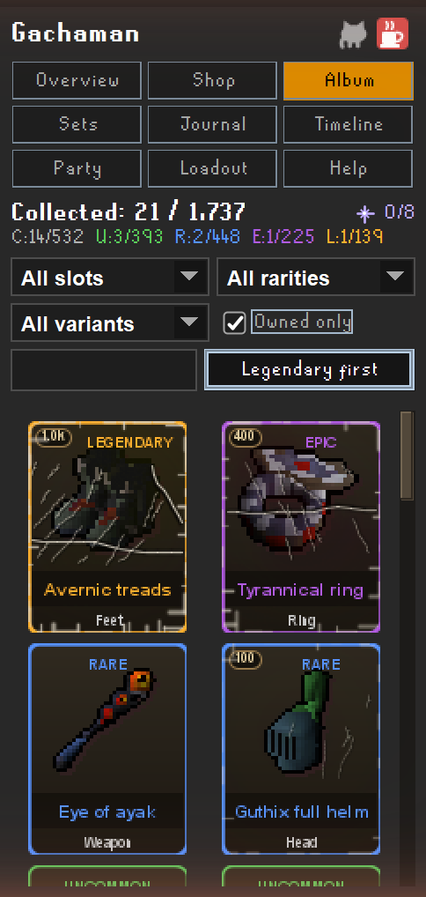

---

## Rolling with friends

Join a RuneLite Party and you can roll **one contract for everybody**.

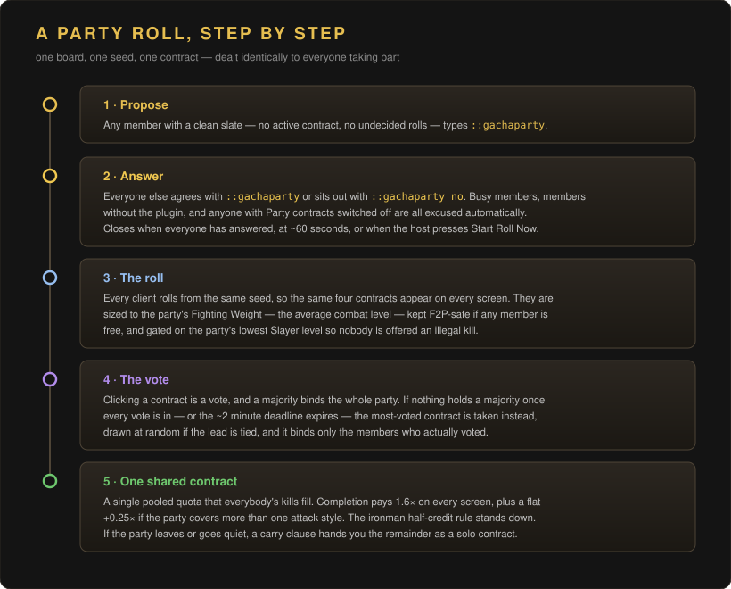

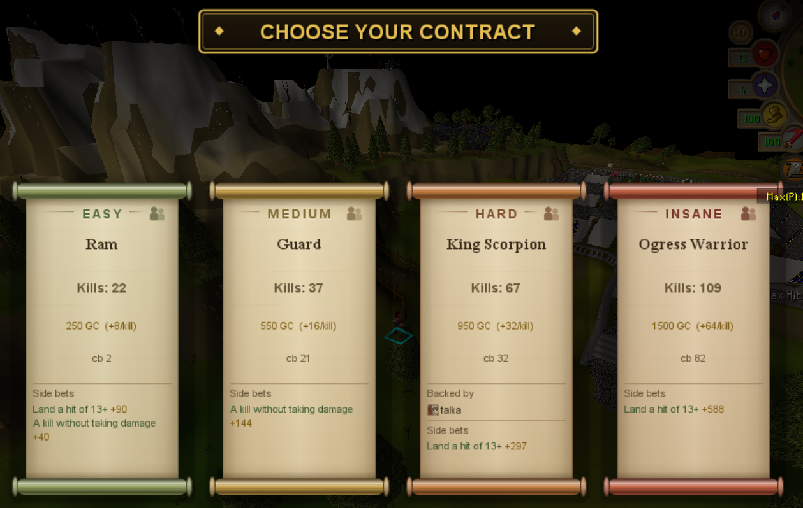

A shared contract means **one pooled quota** that everyone's kills fill, completion pays the **1.6×**
co-op bonus on every screen, and a party covering more than one attack style earns a flat **+0.25×**
clash bonus — paid once, never scaled by how many styles, so any mixed party pays 1.85× while a
mono-style party of any size pays 1.60×. The styles are frozen when the roll starts, alongside the
offers: like every other contract term, the payout is fixed at signing.

### Who the contracts are sized for

The **host** — whoever proposes the roll — picks which combat level the board is built around, and
their choice governs everyone in it:

| Setting | Sizes to | Feels like |
| --- | --- | --- |
| **Fighting Weight** *(default)* | the party's **average** combat level | contracts worth the party's weight; smaller members are carried by the pooled quota |
| **Weakest Man** | the party's **lowest** combat level | every contract is one the smallest member could have taken alone |

Only the host's setting is read — yours applies to the rolls **you** propose. A party can't be half on
one rule and half on the other: the roll is seeded, and two clients sizing to two different levels
would deal two different boards from it. The rule and the level it produced are both printed in chat
before anybody votes.

Quests work the other way round — **every** member's answer counts, not just the host's. A party
board only deals monsters the whole party has unlocked, so one member short of *Priest in Peril*
keeps Nechryael off everyone's board. It has to be the whole party: a shared contract is one pooled
quota, and a monster three of you can reach is still a contract the fourth can't help with.

<details>
<summary>What happens when things go wrong</summary>

- **Someone leaves or goes quiet** — a carry clause converts the contract to solo and hands you the
  remainder.
- **Fewer than two members voted** (as on a host cancel) — the party dissolves, but the four rolled
  contracts still stay put as personal offers, because rolls can't be undone. Accepted contracts stay
  binding.
- **A client crashes mid-vote** — it settles the same vote on its next login, so a crash can never
  leave your board waiting on a count nobody is making.
- **Someone's on an older build** — the roll falls back to whatever every member's client can agree
  on. A build that predates the host's sizing choice puts the party on **Fighting Weight** regardless
  of what the host set; one that predates Fighting Weight itself puts it on the **lowest** combat
  level; one that predates quest gating turns the quest filter **off for everyone** and deals from
  the whole table. It's all-or-nothing by design: the roll is seeded, and two clients disagreeing
  about the pool would deal two different boards. Both overrides are announced in chat **before the
  vote** rather than quietly applied — the quest one especially, because it's the only fallback that
  can put a monster somebody can't reach on the board, and a signed party contract can't be handed
  back.
- **Only the host ever settles a vote** and broadcasts the result, so a vote still in flight can't
  split the party across two contracts.
</details>

### The Party page

A sidebar tab showing who's with you: each member's rolled style as a colour swatch, their combat
level, and badges for taint and for your Patron's Mark with them.

**It's grouped by contract, not by person.** A party is routinely not doing one thing — two members
on one shared contract, two more on another, and somebody still mid-roll — so everyone working the
same contract is drawn as one block under **one** progress meter. A shared contract has one quota,
and repeating "Goblin 12/20" under three names would read as three jobs of twenty. Members on their
own get their own block.

Anyone without a contract says why in a line under their name:

- **No contract** — idle, and free to join a roll.
- **Undecided board** — they have offers dealt and have signed none of them. They can't join a
  shared roll until they pick one or let the board clear. This is the one that isn't obvious from
  looking: they'd otherwise seem idle, and the party would sit waiting on somebody who can't answer.
- **No signal** — their client has said nothing for about a minute.

It is **display only** — no roll, payout or gate reads it. Every line is self-reported by that
member's own client and taken on trust. Turn **Party contracts** off and the tab stays put but
broadcasts nothing and shows nothing — and says so, rather than sitting there looking empty.

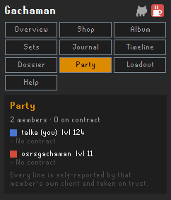

### The Patron's Mark

A private tally of how many shared contracts you've finished alongside each partner. Marks at
**10 / 25 / 100** (Patron I / II / III).

It lives on the **Patrons** tab — everyone you've ever finished a shared contract with, most first,
with their tier and when you last rolled together. The tab appears the day you earn your first mark.
On the Party page each member you have history with wears a coloured pip; whoever you've shared most
with gets a brighter outline.

Keyed by **account**, not by name, so a partner who renames keeps one history instead of forking into
two half-tallies. That identity is a truncated hash of their account — not the account id itself —
and it's the same thing everyone in a RuneLite party can already see about each other, plus nothing.

Deliberately **cosmetic** — it pays no GC and multiplies nothing, because a mark that was worth
something would make farming a friend the correct play.

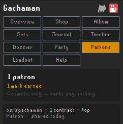

---

## The long game

- **Boss chests.** Boss KC milestones award themed chests that roll only that boss's cards — **62
  bosses** across **64 card sets**, from Obor to Sol Heredit, with **361 monsters** in the contract pool.
- **Set perks.** Completing a themed set grants a permanent bonus. Hologram cards count as every
  member card of their tier for completion purposes.
- **The weekly shop.** A personal rotation of three direct-buy cards, one biased toward what you're
  missing.
- **Prestige.** When you've done everything: burn your common/uncommon collection for a permanent
  rank and compounding bonuses.

---

## Your sidebar

Eleven pages, one of them a help file — and three that don't turn up until you've earned them, so a
fresh account isn't handed three empty tabs to wonder about:

| Tab | What's on it |
| --- | --- |
| **Overview** | Purse, active contract, style, party controls, the board |
| **Shop** | Chests, compactors, extenders, the weekly cards, published Chest Odds |
| **Album** | Every card you own, worn by the service it has seen |
| **Sets** | The 64 sets and what completing each one pays |
| **Journal** | Per-monster kill stats and personal bests |
| **Timeline** | Every roll, pull, equip and event in colour-coded order — the last 500. Pick a from/to window and scrub through it |
| **Dossier** | The honest ledger: every contract finished or failed, newest first, with what it paid. Keeps the last 200, and says so. *Appears with your first finished contract* |
| **Party** | Who's with you, and how they're doing — grouped by shared contract |
| **Patrons** | Everyone you've shared a contract with, most first. *Appears with your first shared contract* |
| **Loadout** | Assign cards to slots. There's an in-game overlay too, plus chatbox card search. *Appears with **One card per slot** on* |
| **Help** | The rules, in the client, when you need them |

The Overview page ends with **Quest-unlocked NPCs** — everything you may currently attack besides
your contract target, and which quest opened it. It hides itself when there is nothing to show, and
it never truncates: if a monster is unlocked, it is on that list.

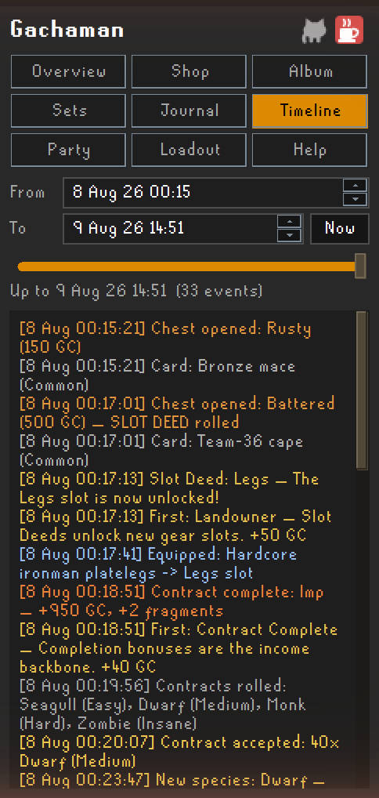

---

## When a quest monster is blocked

Quest combat is protected: an NPC required by an **in-progress** quest can be attacked with any
style, no penalties, no taint. Which NPCs those are comes from a **hand-curated table** shipped with
the plugin, cross-checked against the game's own quest state — so it can have gaps, and a gap looks
like Gachaman refusing to let you kill something your quest just told you to.

**If that happens, please [report the blocked
monster](https://github.com/BraveH/Gachaman/issues/new?template=blocked-quest-npc.yml).** The form
asks for the NPC's exact in-game name and the quest that needs it, plus one question worth answering
carefully: whether the monster was attackable *earlier* in the quest and then stopped. Never-worked
and stopped-working are different bugs and get fixed in different places.

That report is the only way a gap gets found — the plugin cannot tell the difference between a
monster it is right to block and one it is wrong to block. Only you can.

To keep playing while you wait for a fix:

```
::gachaunlock Rat
::gacharelock Rat
```

`::gachaunlock` takes the NPC's exact in-game name and unblocks just that one. It lasts until you
close the client — deliberately, so a bypass can't outlive the bug it worked around and quietly
become part of your run. Anything you have overridden is listed under **Quest-unlocked NPCs** on the
Overview tab, marked as a manual override, so you can always see what you left open.

---

## Honest disclosures

- **Client-side honor mode.** All state lives in your RuneLite profile. Disabling the plugin removes
  every restriction — the gamemode is a contract with yourself.
- **Menu modification.** The plugin removes Wield/Wear/Equip/Hold menu entries and consumes clicks on
  card-locked equipment.
- **One automated action.** Stepping off Tutorial Island fires the game's own "Remove" option on each
  worn item, once per account, to clear gear no card has unlocked yet (one item per tick; it stops if
  your inventory is full, and resumes on your next login until everything is off). Accounts that
  install the plugin after the tutorial are never stripped. **Apart from that single one-shot, the
  plugin issues no actions on your behalf.**
- **Party features are trust-based**, like all client-side party plugins. Everything on the Party page
  is self-reported by that member's own client; it is drawn, never trusted by a rule. Remote values
  are clamped to sane ranges before they're shown.
- **What your client tells your party.** While **Party contracts** is on, your client broadcasts your
  rolled style, combat level, current contract and its progress, whether you have a board waiting,
  and one identity token — a truncated SHA-256 of your account hash, never the hash itself — so that
  a Patron's Mark survives a rename and shared contracts group correctly. Nothing else, nothing to
  anyone outside your party, and nothing at all when the setting is off.
- **The Ante risks only Gacha Coins**, the plugin's own currency. It's off by default, never
  preselected, and always takes an explicit confirmation. No real currency, no game gold, and nothing
  outside your own save is ever at stake.
- **The house odds are published.** The chest weighting that favours gear you can already wield is a
  stated number (0.35×), and the Shop tab prints the resulting percentages from the same constants the
  roller uses.
- **No external requests.** Card art uses the game's own item sprites via RuneLite's item manager.

---

## Settings

<details>
<summary><b>General</b></summary>

- **Sounds** *(on)* — play ceremony and reward sounds
- **Sound volume** *(70)* — ceremony sound volume, 0–100
- **Chat notifications** *(on)* — informational chat lines (starter grants, vouchers, milestones).
  Enforcement feedback — style penalties, pardons, tainted and assisted kills, blocked equips — always
  shows regardless
- **Highlight task NPCs** *(on)* — outline NPCs matching your active contract
- **One card per slot** *(on)* — ON: an unlocked item is wearable only while its card is assigned to a
  loadout slot. OFF: owning the card is enough, and the Loadout page hides
- **The Ante** *(**off**)* — offer the voluntary stake on Insane contracts. Off hides the offer
  entirely; nothing is ever staked without an explicit confirmation
</details>

<details>
<summary><b>Enforcement</b></summary>

- **Style warning duration** *(60s)* — how long the "style changed, switch gear" chip shows
</details>

<details>
<summary><b>Party</b></summary>

- **Party contracts** *(on)* — take part in shared party rolls while in a RuneLite Party. When off you
  count as busy: proposals excuse you automatically, you cannot propose or join, the party UI on the
  Overview page hides, and your client broadcasts no presence (the Party tab stays but shows nothing)
- **Party contract sizing** *(Fighting Weight)* — which combat level a party roll sizes to: the party's
  average (Fighting Weight) or its lowest (Weakest Man). Applies to the rolls **you host** — in
  somebody else's roll, theirs is the one that counts
</details>

<details>
<summary><b>Advanced</b></summary>

- **Combat aborts ceremonies** *(on)* — taking damage or being targeted closes a reveal safely; the
  outcome is still granted
- **Debug commands** *(off)* — enable the `::gacha*` developer commands
</details>

---

## Commands

**Always available:**

| Command | What it does |
| --- | --- |
| `::gachaparty` | Propose a party roll, or agree to a live proposal |
| `::gachaparty no` | Sit this one out |
| `::gachaparty start` | *Host only.* Start immediately with whoever has agreed (minimum 2) |
| `::gachaparty cancel` | *Host only.* During the answer phase it aborts the roll outright. After the offers are rolled it dissolves the **party** only — the rolled contracts remain for every participant as personal offers, and accepted contracts stay binding |
| `::gachaunlock <npc name>` | Unblock a quest monster the table missed, **for this session only** — see [When a quest monster is blocked](#when-a-quest-monster-is-blocked) |
| `::gacharelock <npc name>` | Undo one override. With no name, clears every override |

The `::gachaparty` commands require the **Party contracts** setting (on by default). The unlock pair
does not — it is an escape hatch, and a player stuck behind a bad exemption should not have to find a
setting first.

<details>
<summary><b>Debug commands</b> — enable <i>Advanced → Debug commands</i> first</summary>

| Command | What it does |
| --- | --- |
| `::gachagive <amount>` | Grant GC (default 10,000) |
| `::gachachest <rusty\|battered\|gilded\|ornate>` | Open a chest without paying (default battered) |
| `::gachatask` | Roll contract offers |
| `::gachastyle` | Force a style roulette roll |
| `::gachatoken` | Grant a card reroll token |
| `::gachacleartaint` | Clear all taint debt |
| `::gachacleartask` | Wipe the active contract and rolled offers |
| `::gachawear <none\|hairline\|cracked\|shattered\|N> [name]` | Set the Service Record on owned cards so the wear shows. `name` is a substring — leave it off to hit every card |
| `::gachabutton` | Print loadout-button render diagnostics |
| `::gachacosmetics [maxTotal]` | Audit: list untiered cards at or below a combat-bonus threshold (default 6) |
</details>

---

## Building it yourself

```sh
./gradlew build   # compile + full unit suite (fixed-seed RNG, dataset integrity,
                  # codec round-trips, generator bounds at every combat level)
./gradlew run     # launch a dev client with the plugin loaded
```

Things the unit suite can't reach are listed in [docs/manual-testing.md](docs/manual-testing.md).

---

<p align="center">
  <sub>Support development on <a href="https://ko-fi.com/amrothabet">Ko-fi</a> · source on <a href="https://github.com/BraveH/Gachaman">GitHub</a></sub>
</p>
